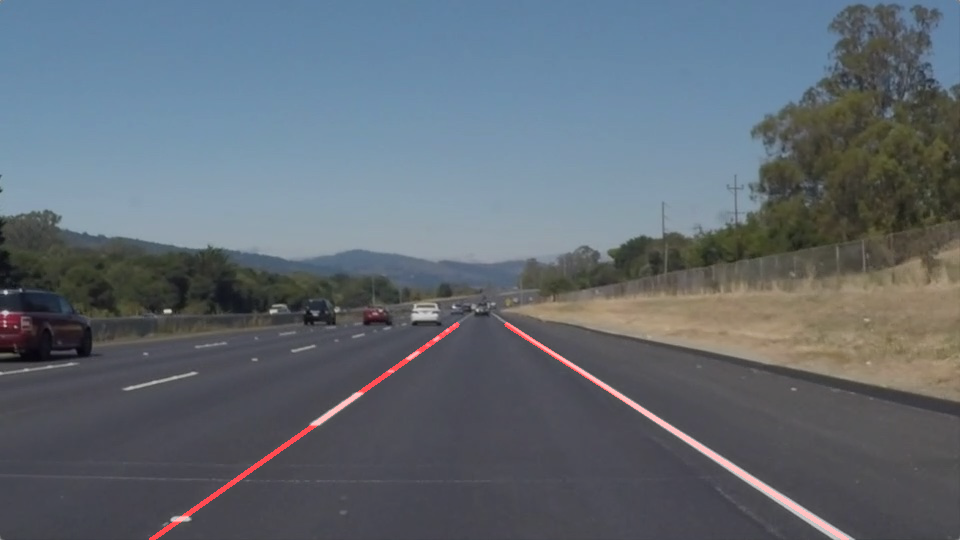

# **Project: Finding Lane Lines on the Road** 

  

Overview
---

When we drive, we use our eyes to decide where to go.  The lines on the road that show us where the lanes are act as our constant reference for where to steer the vehicle.  Naturally, one of the first things we would like to do in developing a self-driving car is to automatically detect lane lines using an algorithm.

The purpose of this project is to detect lane lines in images using Python and OpenCV.  OpenCV means "Open-Source Computer Vision", which is a package that has many useful tools for analyzing images.
The project implementation includes the following files and folders:
1. P1.ipynb, which is a Jupyter notebook file that contains project code and description of the pipeline along with testing results.
2. writeup.md, which contains a brief write up explaining the solution with example images from various stages in the code development.
3. Pipeline was applied to images included in the test_images folder with the resulting lane detections saved under the test_images_output folder.
4. The Pipeline was further test with the video feeds found in test_videos folder and the resulting videos were stored in test_videos_output folder.

For additional details and information on the project requirements and the template files, please visit [Udacity Git-Hub](https://github.com/udacity/CarND-LaneLines-P1). Please note that using this code requires the installation of [CarND Term1 Starter Kit](https://github.com/udacity/CarND-Term1-Starter-Kit/blob/master/README.md).
